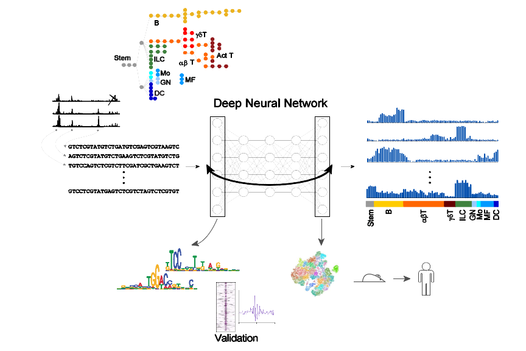

# Convolutional neural network to predict immune cell chromatin state
AI-TAC is a deep convoluional network for predicting mouse immune cell ATAC-seq signal from peak sequences using data from the Immunological Genome Project:  http://www.immgen.org/.




## Requirements
The code was written in python v3.6.3 and pytorch v1.4.0, and run on NVIDIA P100 Pascal GPUs.

## Tutorial

The processed data files can be downloaded using the following links:
  - [bed file containing peak locations](https://www.dropbox.com/s/r8drj2wxc07bt4j/ImmGenATAC1219.peak_matched.txt?dl=0)
  - [](https://www.dropbox.com/s/7mmd4v760eux755/mouse_peak_heights.csv?dl=0)

The required input is a bed file with ATAC-seq peak locations, the reference genome and a file with normalized peak heights.  The code for processing raw data is in data_processing/; for example, to convert the ImmGen mouse data set to one-hot encoded sequences and save in the data directory, run:

```python
python process_data.py "../data/ImmGenATAC1219.peak_matched.txt" "../data/mouse_peak_heights.csv" "../mm10/" "../data/"
```

The model can then be trained by running:
```python
python train_test_aitac.py model_name '../data/one_hot_seqs.npy' '../data/cell_type_array.npy' '../data/peak_names.npy'
```

To extract first layer motifs run:
```python
python -u extract_motifs.py model_name '../data/one_hot_seqs.npy' '../data/cell_type_array.npy' '../data/peak_names.npy'
```
## Reference
[Learning immune cell differentiation. Alexandra Maslova, Ricardo N. Ramirez, Ke Ma, Hugo Schmutz, Chendi Wang, Curtis Fox, Bernard Ng, Christophe Benoist, Sara Mostafavi, the Immunological Genome Project, bioRxiv 2019.12.21.885814; doi: https://doi.org/10.1101/2019.12.21.885814](https://www.biorxiv.org/content/10.1101/2019.12.21.885814v1)
